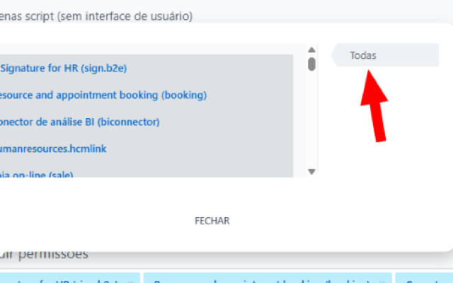

# Bitrix24 Button Fix Chrome Extension

A Chrome extension that automatically clicks all items in Bitrix24 popups when the "Todas" (All) button is pressed.

**[📄 View Privacy Policy](docs/index.html)**

## Features

-   Automatically detects Bitrix24 popup dialogs (including those in iframes)
-   Finds the "Todas" button when it becomes available
-   Clicks all items in the popup with a single button press
-   Works seamlessly with Bitrix24's dynamic content loading

## Installation

### From Chrome Web Store

_(Coming soon)_

### Manual Installation (Developer Mode)

1. Download or clone this repository
2. Open Chrome and navigate to `chrome://extensions/`
3. Enable "Developer mode" in the top right corner
4. Click "Load unpacked" and select the extension folder
5. The extension will now be active on Bitrix24 pages

## Usage

1. Navigate to any Bitrix24 page
2. Open a popup that contains selectable items
3. Click the "Todas" button - the extension will automatically detect this and click all items in the list

### Visual Guide

The extension works with popups like this one, where you can see the "Todas" button in the top-right corner:

_The red arrow points to the "Todas" button that the extension will automatically detect and enhance with one-click functionality to select all items in the list._

When you click the "Todas" button, the extension will automatically:

-   Detect the button click
-   Find all selectable items in the popup (like the apps shown: e-Signature for HR, Resource and appointment booking, etc.)
-   Click each item to select them all
-   Save you time from manually clicking each individual item

## Technical Details

-   **Manifest Version**: 3
-   **Permissions**: `activeTab` (only accesses current tab when needed)
-   **Supported Domains**:
    -   `*.bitrix24.com/*`
    -   `*.bitrix24.com.br/*`
    -   `*.bitrix24.site/*`

## How It Works

The extension uses content scripts to:

1. Monitor for the appearance of the "Todas" button
2. Detect if the popup is rendered in the main document or an iframe
3. Attach click listeners to the button when found
4. Execute the item-clicking logic in the correct document context

## Development

To modify or debug the extension:

1. Make changes to the source files
2. Go to `chrome://extensions/`
3. Click the refresh icon on the extension card
4. Test your changes on a Bitrix24 page

## Files

-   `manifest.json` - Extension configuration
-   `content.js` - Main functionality script
-   `images/` - Extension icons

## License

MIT License - Feel free to use and modify as needed.

## Contributing

Issues and pull requests are welcome!

1. Navigate to your Bitrix24 portal
2. Open any popup that contains the "Todas" button (like the integration selector)
3. Click the "Todas" button
4. The extension will automatically click all items in the list

## Files Structure

-   `manifest.json` - Extension configuration
-   `content.js` - Main script that handles the button clicks
-   `images/` - Extension icons
    -   `icon16.png` - 16x16 icon
    -   `icon48.png` - 48x48 icon
    -   `icon128.png` - 128x128 icon

## How it works

The extension uses a content script that:

1. Listens for clicks on elements with the class `ui-tile-selector-searcher-sidebar-item`
2. Checks if the clicked element contains the text "Todas"
3. When detected, it finds the container with class `ui-tile-selector-searcher-content`
4. Clicks all child elements (items) within that container

## Debugging

Open the browser's Developer Tools (F12) and check the Console tab to see logging messages from the extension.

## Compatibility

-   Chrome/Chromium browsers
-   Manifest V3 compatible
-   Works with all Bitrix24 domains

## Privacy

This extension does not collect, store, or transmit any personal data. All functionality operates locally within your browser. For complete details, see our [Privacy Policy](https://mruniverse.github.io/Bitrix24ButtonFix/).

## License

MIT License - Feel free to use and modify as needed.
